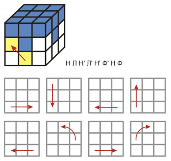
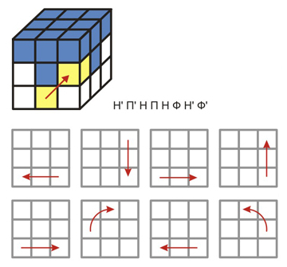
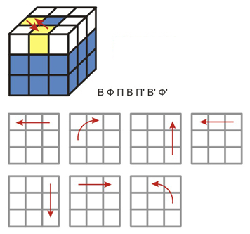
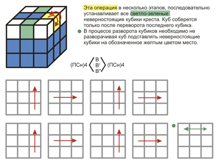
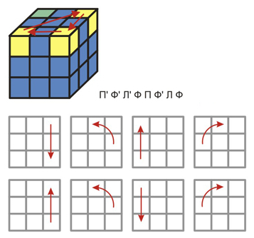
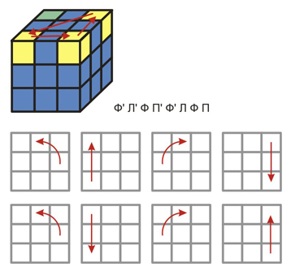
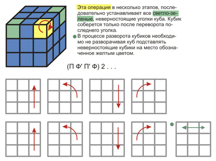
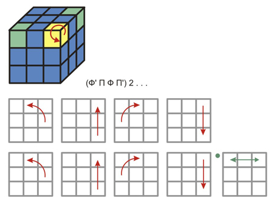

---

[:link: источник](https://welday.org/blog/interesting/rubiks-cube/)

---

> [r/nextfuckinglevel](https://t.me/Reddit/29552)
~Четыре самых простых способа собрать кубик Рубика. Сохраняем и используем!~ **так не работает, есть невращающиеся части**